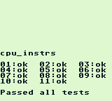

# GBZD 


Yet another Gameboy emulator.


## Goals
* Build an emulator that is reasonably accurate
    * Compatible with most popular games on the system
    * Games play pretty much how the user remembers them

* Learn some Rust with a real project

* Brush up on microcontroller fundamentals

* Scratch the retro-computing itch

## Testing

* In accordance with the 'reasonable accuracy' benchmark, the emulator is built to pass the blargg CPU test suite, and the dmg-acid2 PPU (rendering) test. Results follow.
    * Blargg cpu_instrs:
        * 
    * dmg-acid2:
        * 

## Getting started
* Note: Only tested on Windows 10+
* Ensure Rust's Cargo build tools are installed
* Navigate to the project root directory
* ```cargo build -r```
* ```cargo run -r <path to ROM file>```
* Grab a controller and get going!
    * Only a PS5 Dualsense has been tested, but most Windows compatible controllers should work

## Design principles and explanation of intended inaccuracies
GBZD is a single-threaded application with 3 noteworthy components
* Abstracted memory map
* CPU
* PPU

At a high level, there's a simple load balancing heuristic that decides whether whether the CPU or PPU runs next based on how much 'debt' has been accumulated by one side relative to the other.

Periodically the PPU is queried to see if it has a frame ready to present, and the frame is presented when ready. The system then waits an amount of time based on how long the CPU and PPU took to generate one frame, enforcing a ~60Hz refresh rate mimicking that of the original Gameboy.

#### Memory map
The memory map can be viewed as the backbone of the emulator, providing an interface to all of the system memory and emulated hardware peripherals such as the main timer, cartridges, and the like. 

The memory map uses a simple interface consisting of read and write calls on 'memory units' of 8 bits (Byte) or 16 bits (Word) within a 16 bit address space. As a convention, the memory regions and devices which compose into this memory map provide implementations of this interface and make use of it whenever possible to provide the code with a telescoping quality.

All components which access the memory map have shared ownership of it. 

#### CPU
Not much to say about this. The general idea is that this should be the most boring component of the system, following the specification in the Gameboy Pandocs relatively accurately, barring a few quirks that are painful to implement like exact cycle accuracy on interrupts, and T-cycle resolution.

The CPU is initialized to a post-bootrom state so the user does not have to provide a copy, then begins a bog standard fetch-decode-execute behavior, reporting how many cycles it took to execute any particular instruction for debt tracking and synchronization purposes.

The CPU's interface consists of the run call, which typically executes one instruction and returns the number of M-cycles that the instruction took to complete. Special cases arise when servicing available interrupts or when the CPU is stopped/halted. In these cases, the run services the next enabled interrupt (if applicable) and kicks control back to the caller, reporting no work done.

#### PPU
This is where most of the creative liberties with the system are taken. The PPU in GBZD is treated like a glorified presentation layer with concessions made to acknowledge the PPU's role in firing STAT and VBLANK interrupts. As such, the compromise made is to implement the PPU as a scan-line renderer, clocking in the render state once per horizontal line. This degree of accuracy was chosen because unless a game is relying on some very strange timings for drawing things, any unit of drawing (scan line) will be drawn coherently relative to anything within itself.

The PPU is a state machine cycling through 4 primary modes: OAM scan, pixel draw, horizontal blank, and vertical blank. This implementation typically defers any processing done in these modes until the end of the state is reached. In the interim, any PPU run will just chew off a portion of the state's remaining cycles at some arbitrary granularity and kick processing back to the caller, to let the CPU churn some more. The PPU also cheats on the cycle-length of each of these modes. Since this emulator assumes it will be running well-defined software, it will kick the state over to the next mode as soon as it is allowed, regardless of how long it would take. This is the safest default, because well-defined games will wait at least this long before trying to contend with VRAM contents.

This implementation uses a simple model for background and sprite rendering. It operates with 2 layers, the background/window layer, and the sprite layer. The background/window layer is painted onto the scanline first, and the sprite layer is sloppily painted on top of that. Scan lines are collated into the backbuffer of a double buffered render target.

The PPU interface exposes 3 methods. One is the run method, which churns through the state machine in little increments and reports how long it spent doing so for debt tracking and synchronization. Another gets a handle to the frontbuffer of the double buffered render target. The last one queries the PPU if a new frame is ready since the last time checked.

#### Bonus: Input
Another device that owns a memory map. This one is defined by a generic wrapper around all possible Gameboy inputs. This wrapper can be constructed by providing one or more implementations of the InputDevice interface, bridging real input devices such as game controllers to the Gameboy's joypad register interface and handling any interrupts that should be raised. Input is polled.

## Future feature roadmap
* Audio playback (Lack of audio is seriously unsatisfying!)
* More robust UI and display
    * Scaling of display output to support non-native resolutions
    * Post-processing to replicate low response time LCD ghosting and other effects
    * Save states, so the games don't go poof the moment the system turns off